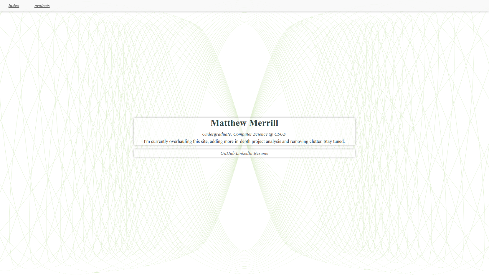
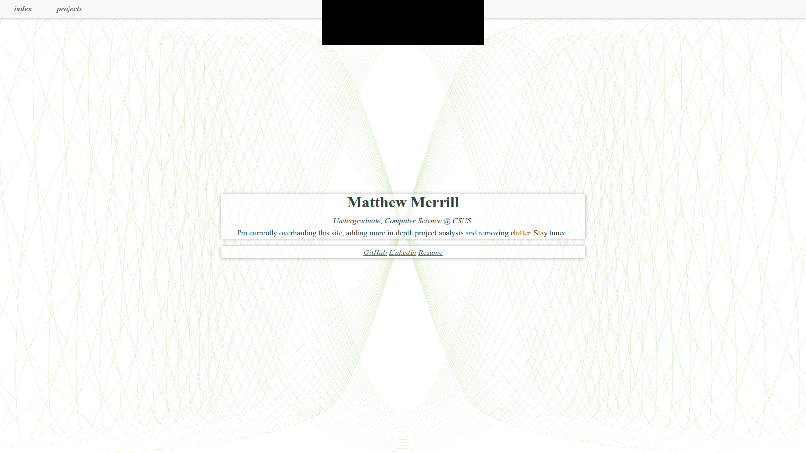

# notchify
Upgrade your website to the latest notch trend.

### Installation
```
<script src="https://cdn.rawgit.com/MatthewMerrill/notchify/master/notchify.js"
        integrity="sha384-dp2eWi3ZVzGNslST8sPFqKYIAFacRX7I6Mz7J+1lh+Jry4f7cnjAbLqloN0ppRpO"
        crossorigin="anonymous"></script>
```

### Before


### After

